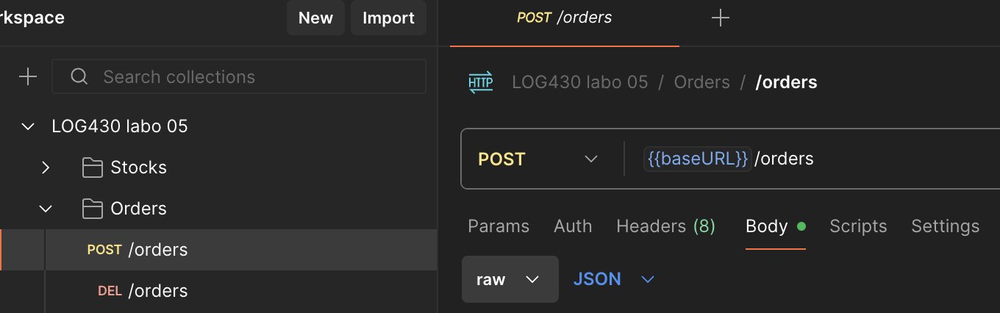
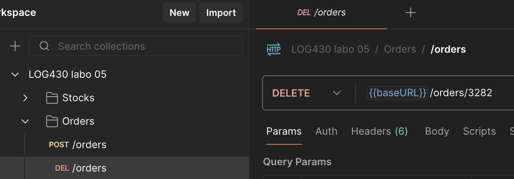

# Labo XX — Rapport

 \
Jean-Christophe Benoit \
Rapport de laboratoire \
LOG430 — Architecture logicielle \
2 novembre 2025, Montréal \
École de technologie supérieure

## Questions

> J'ai crée ce PDF en utilisant le gabarit markdown (.md).

### Question 1
> Lequel de ces fichiers Python représente la logique de la machine à états décrite dans les diagrammes du document arc42? Est-ce que son implémentation est complète ou y a-t-il des éléments qui manquent? 

Le fichier `order_saga_controller.py` représente la logique de la machine d'états. Les états CREATING_PAYMENT, INCREASING_STOCK et CANCELLING_ORDER ne sont pas encore pris en compte dans la machine d'états. Cela veut dire qu'il n'y a pas de rollback sur le stock, de création de payment via le service de paiement ou de cancelation de commande dans le cas d'une erreur :

```python
while self.current_saga_state is not OrderSagaState.COMPLETED:
    if self.current_saga_state == OrderSagaState.CREATING_ORDER:
        self.current_saga_state = self.create_order_handler.run()
    elif self.current_saga_state == OrderSagaState.DECREASING_STOCK:
        self.increase_stock_handler = DecreaseStockHandler(order_data["items"])
        self.current_saga_state = self.increase_stock_handler.run()
    else:
        self.is_error_occurred = True
        self.logger.debug(f"L'état saga n'est pas valide : {self.current_saga_state}")
        self.current_saga_state = OrderSagaState.COMPLETED
```

Ces opérations manquantes seront mises en place dans les prochaines étapes.

### Question 2
> Lequel de ces fichiers Python déclenche la création ou suppression des commandes? Est-ce qu'il accède à une base de données directement pour le faire? Illustrez votre réponse avec des extraits de code.

Le fichier `create_order_handler.py` déclenche la création ou suppression des commandes en faisant appel à l'API du store manager.

La méthode run fait appel au point d'entrée pour créer une nouvelle commande :

```python
response = requests.post(f'{config.API_GATEWAY_URL}/store-manager-api/orders',
    json=self.order_data,
    headers={'Content-Type': 'application/json'}
)
```

La méthode rollback fait un appel au point d'entrée pour supprimer une commande :

```python
response = requests.delete(f'{config.API_GATEWAY_URL}/store-manager-api/orders/{self.order_id}')
```

### Question 3
> Quelle requête dans la collection Postman du Labo 05 correspond à l'endpoint appelé dans create_order_handler.py? Illustrez votre réponse avec des captures d'écran ou extraits de code.

Les requêtes POST et DELETE /orders sont les requêtes Postman correspondantes comme mentionné dans la réponse de la question précédente : 





### Question 4
> Quel endpoint avez-vous appelé pour modifier le stock? Quelles informations de la commande avez-vous utilisées? Illustrez votre réponse avec des extraits de code.

Pour faire la sortie et le retour des produits de la commande, j'ai fait appel au endpoint PUT /store-manager-api/stocks et j'ai utilisé les items de la commande qui étaient déjà passés à la classe DecreaseStockHandler.

Pour retirer du stock des produits :
```python
stock_req = {
    "items": self.order_item_data,
    "operation": "-"
}
response = requests.put(f'{config.API_GATEWAY_URL}/store-manager-api/stocks',
    json=stock_req,
    headers={'Content-Type': 'application/json'}
)
```

Pour remettre du stock des produits :
```python
stock_req = {
    "items": self.order_item_data,
    "operation": "+"
}
response = requests.put(f'{config.API_GATEWAY_URL}/store-manager-api/stocks',
    json=stock_req,
    headers={'Content-Type': 'application/json'}
)
```

### Question 5
> Quel endpoint avez-vous appelé pour générer une transaction de paiement? Quelles informations de la commande avez-vous utilisées? Illustrez votre réponse avec des extraits de code.

J'ai utilisé le endpoint GET /sotre-manager-api/orders pour récupérer le montant total de la commande et ensuite le endpoint POST /payments-api/payments pour créer une transaction de paiement.

Pour récupérer la commande : 
```python
get_order_resp = {}
response = requests.get(f'{config.API_GATEWAY_URL}/store-manager-api/orders/{self.order_id}')
if response.ok:
    self.logger.debug("La récupération de la commande a réussi")
    get_order_resp = response.json()
    self.logger.debug(f"received order : {get_order_resp}")
else:
    get_order_resp = response.json() 
    self.logger.error(f"Erreur {response.status_code} : {get_order_resp}")
    return OrderSagaState.INCREASING_STOCK
```

Pour créer la transaction de paiment : 
```python
create_payment_req = {
    "user_id": self.order_data["user_id"],
    "order_id": self.order_id,
    "total_amount": get_order_resp["total_amount"]
}
response = requests.post(f'{config.API_GATEWAY_URL}/payments-api/payments',
    json=create_payment_req,
    headers={'Content-Type': 'application/json'}
)
if response.ok:
    self.logger.debug("La création d'une transaction de paiement a réussi")
    return OrderSagaState.COMPLETED
else:
    self.logger.error(f"Erreur : {response.ok}")
    return OrderSagaState.INCREASING_STOCK
```

### Question 6
> Quelle est la différence entre appeler l'orchestrateur Saga et appeler directement les endpoints des services individuels? Quels sont les avantages et inconvénients de chaque approche? Illustrez votre réponse avec des captures d'écran ou extraits de code.

Appeler l'orchestrateur Saga nous permet de garder l'exactitude des données à travers plusieurs services sans devoir utiliser de transactions distribuées et l'orchestrateur offre une façon centralisée de gérer les transformations et état de la donnée. Cependant, les rollbacks de transformation ne sont pas automatiques et nous devons explicitement définir des endpoints sur nos services pour pouvoir revenir en arrière. 

De plus avec l'implémentation actuelle nous n'avons plus accès au lien de paiement en faisant une requête GET /orders au service de commande, car lors de la création de la commande, nous n'avons pas encore le lien de paiement qu'on peut insérer dans Redis : 
```python
session.commit()
logger.debug("Une commande a été ajouté")

# Insert order into Redis
#update_stock_redis(order_items, '-')
add_order_to_redis(order_id, user_id, total_amount, items, "")
```

Pour ce faire, il faudrait explicitement impl/menter des fonction asynchrones de synchronisation entre les différentes méthodes de stockage de données.

Il faut aussi considérer que si l'orchestrateur Saga ne fonctionne plus, plus aucune commande ne peut être créée. Cela est un _single point of failure_ pattern qu'on est mieux d'éviter.

Finalement, on remarque aussi que ce pattern nous oblige à faire plus d'appels HTTP, augmentant ainsi la latence du système en général.

## Observations additionnelles

- Observations sur d’éventuels problèmes de setup ou de code rencontrés lors de l’exécution des activités (optionel).
- Particularités de votre configuration CI/CD (ex. : utilisation d’une VM, d’un service infonuagique comme Azure, etc.).
